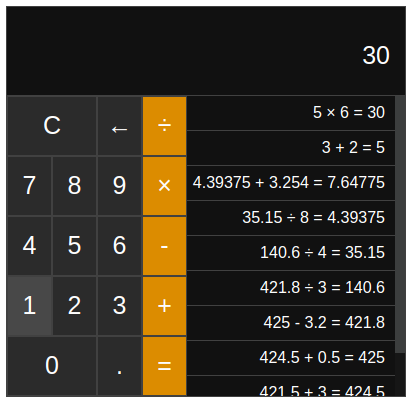
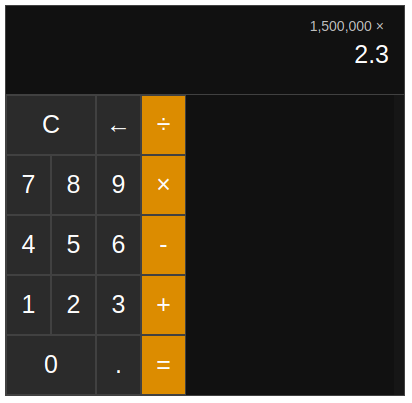

# react-calculator

Simple 4 function calculator implemented in react

### Features

- Just look at the pictures, its a calculator you know what it does.
- Dark mode

## Setup and run

### Node

```bash
npm install
npm start
```

Also works with yarn if you prefer

## Pictures



